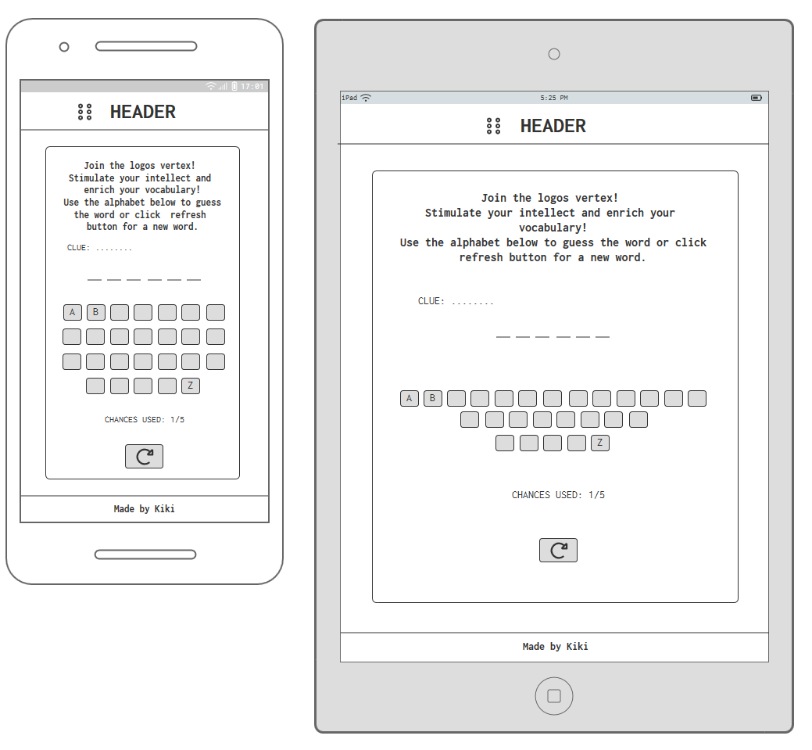

# The logos vertex

Visit the deployed site: [The logos vertex](https://kikiberg.github.io/Logos-vertex/)

This project is my second student project. 

## CONTENTS

* [User Experience](#user-experience-ux)
  * [User Stories](#user-stories)

* [Design](#design)
  * [Colour Scheme](#colour-scheme)
  * [Typography](#typography)
  * [Imagery](#imagery)
  * [Wireframes](#wireframes)
  * [Features](#features)
    * [The Main Page](#the-main-page)   
    * [Future Implementations](#future-implementations)
  * [Accessibility](#accessibility)

* [Technologies Used](#technologies-used)
  * [Languages Used](#languages-used)
  * [Frameworks, Libraries & Programs Used](#frameworks-libraries--programs-used)

* [Deployment & Local Development](#deployment--local-development)
  * [Deployment](#deployment)
  * [Local Development](#local-development)
    * [How to Fork](#how-to-fork)
    * [How to Clone](#how-to-clone)

* [Testing](#testing)

* [Credits](#credits)
  * [Code Used](#code-used)
  * [Content](#content)
  * [Media](#media)
  * [Acknowledgments](#acknowledgments)

- - -

## User Experience (UX)

I wanted to create a fun game that enriches the players' vocabulary and stimulates their intellect.

### User Stories

#### First Time Visitor Goals

* I want to make it interesting enough for possible future users.
* I want the game to be responsive for different device sizes.
* I want the game to be easy to use.

#### Returning and frequent Visitor Goals

* I want to be able to see updates (news page) about Kiki's fulfillments.

- - -

### Colour Scheme

As the game expects the user to reflect and come up with the correct word, I wanted to keep the colour scheme coherent and straightforward so as to not overwhelm users. 
* I have used `#C44739` & `#43A579` as the primary and secondary colours used for the sites text.
* I have used `#FFEDD4` as the overlay for the background.
* I have used `#FAD7A7` for the main game area.

  

### Typography

Google Fonts was used to import the chosen font for use in the site.

I have used the google font [Poppins](https://fonts.google.com/specimen/Poppins). The reasons I chose this one is:
* Readability on screens of all sizes.
* Versatility with a variety of weights and styles.
* Aesthetic appeal with a modern and elegant design.
* Multilingual support for diverse audiences.
* Web optimization for consistent rendering across browsers.
* Accessibility compliance for improved readability for all users.

### Imagery

As the website is about finding the correct behind, I wanted to implement some modals when the player succeeds or not. It makes it funny and even when the player fails to find the word, they're give a "Try again" message.

### Wireframes

I started sketchin by hand to get an initial understanding of the device sizes in relation to what I wanted to show. 
Then I used balsamiq to make it more concrete and structured.

### Features

The website is comprised of just one page.
The page is responsive and has:

* A favicon in the browser tab.

* A header at the top of the page. 

* A footer at the bottom of the page. 

#### Main Page

The main page of Logos Vertex displays the site's name as a header and then there's a main game area separated from the background.

#### Future Implementations

In future implementations I would like to:

1. Add a function that shows how many points the user has collected.
2. Add a function that gives the easier words first and then more and more difficult words show up as the user succeeds to guess correctly.
3. Add a function that makes it possible to refresh a word only when there's 1 chance left and not from the very beginning.

### Accessibility

I have tried during coding to ensure that the website is as accessible friendly as possible. This has been have achieved by:

* Using semantic HTML, like main, header, footer elements.
* Using a hover state on all buttons to make it clear to the user if they are hovering over a letter or a button.
* Choosing a sans serif font for the site - these fonts are suitable for people with dyslexia.
* I looked into red/green colour blindness. I used the chrome extension [Web Disability Simulator](https://chrome.google.com/webstore/detail/web-disability-simulator/olioanlbgbpmdlgjnnampnnlohigkjla) to be able to see what someone with red/green colour blindness would see.

- - -

## Technologies Used

### Languages Used

HTML, CSS, Javascript

### Frameworks, Libraries & Programs Used

* [Font Awesome](https://fontawesome.com/) - Used for the icons.

* [Balsamiq](https://balsamiq.com/) - Used to create wireframes.

* [Github](https://github.com/) - To save and store the files for the website.

* [GitPod](https://gitpod.io/) - IDE used to create the site.

* [Google Fonts](https://fonts.google.com/) - To import the font used on the website.

* [Google Developer Tools](https://developers.google.com/web/tools) - To troubleshoot and test features, solve issues with responsiveness and styling.

* [TinyPNG](https://tinypng.com/) To compress images

* [Birme](https://www.birme.net/) To resize images and convert to webp format.

* [Favicon.io](https://favicon.io/) To create favicon.

* [Am I Responsive?](http://ami.responsivedesign.is/) To show the website image on a range of devices.

* [Shields.io](https://shields.io/) To add static badges to the README

* [Web Disability Simulator](https://chrome.google.com/webstore/detail/web-disability-simulator/olioanlbgbpmdlgjnnampnnlohigkjla) - a google chrome extension that allows you to view your site as people with accessibility needs would see it.

* [Webpage Spell-Check](https://chrome.google.com/webstore/detail/webpage-spell-check/mgdhaoimpabdhmacaclbbjddhngchjik/related) - a google chrome extension that allows you to spell check your webpage. Used to check the site and the readme for spelling errors.

* [Color Hex](https://www.color-hex.com/) For finding inspiration about the color palettes I would use.

- - -

## Deployment & Local Development

### Deployment

The site is deployed using GitHub Pages - [Logos Vertex](https://github.com/KikiBerg/Logos-vertex).

To Deploy the site using GitHub Pages:

1. Login (or signup) to Github.
2. Go to the repository for this project, [KikiBerg/Logos-vertex](https://github.com/KikiBerg/Logos-vertex).
3. Click the settings button.
4. Select pages in the left hand navigation menu.
5. From the source dropdown select main branch and press save.
6. The site has now been deployed, please note that this process may take a few minutes before the site goes live.

### Local Development

#### How to Fork

To fork the repository:

1. Log in (or sign up) to Github.
2. Go to the repository for this project, [KikiBerg/Logos-vertex](https://github.com/KikiBerg/Logos-vertex)
3. Click the Fork button in the top right corner.

#### How to Clone

To clone the repository:

1. Log in (or sign up) to GitHub.
2. Go to the repository for this project, [KikiBerg/Logos-vertex](https://github.com/KikiBerg/Logos-vertex)
3. Click on the code button, select whether you would like to clone with HTTPS, SSH or GitHub CLI and copy the link shown.
4. Open the terminal in your code editor and change the current working directory to the location you want to use for the cloned directory.
5. Type 'git clone' into the terminal and then paste the link you copied in step 3. Press enter.

- - -

## Testing

Please refer to [TESTING.md](TESTING.md) file for all testing carried out.

- - -

## Credits

### Code Used

* The basic code for building the game was inspired by the following tutorial which I then adapted for my own game. - [Word Scramble Game in HTML CSS & JavaScript](https://www.codingnepalweb.com/word-scramble-game-html-javascript/) by CodingNepal.

### Content

* All the text content was written by myself. 
* I got help from [chatgpt](chat.openai.com/) and [Phind ](https://www.phind.com/) to generate a list of words that are of greek origin and are often used in English.

### Media

* [Pexels](https://www.pexels.com/) were used for the cat images.

### Acknowledgments

I would like to acknowledge the following people:

* Jubril Akolade - My Code Institute Mentor.

* The Tutor support from Code Institute for assisting and explaining.

* My fellow co-student [Efi](https://github.com/EfthymiaKakoulidou) for giving me feedback and reviewing my project.
