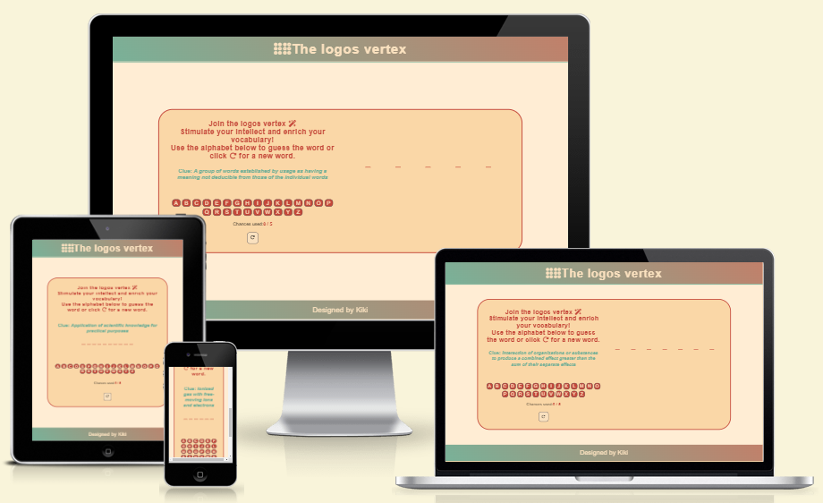

# The Logos vertex! -  Testing

Visit the deployed site: [The Logos vertex](https://kikiberg.github.io/Logos-vertex/)

Return back to the [README.md](README.md) file.

- - -

## CONTENTS

* [AUTOMATED TESTING](#automated-testing)
  * [W3C & JSHint Validators](#validators)
  * [Lighthouse](#lighthouse)
  * [Responsiveness](#responsiveness)
  * [Browser Compatibility](#browser-compatibility)

* [MANUAL TESTING](#manual-testing)
  * [Testing User Stories](#testing-user-stories)
  * [User Testing](#user-testing)
  * [Full Testing](#full-testing)

* [BUGS](#bugs)

Testing was ongoing throughout the entire build. I utilised Chrome developer tools whilst building to pinpoint and troubleshoot any issues as I went along.
During development I made use of google developer tools to ensure everything was working correctly and to assist with troubleshooting when things were not working as expected.
and were responsive on a variety of different screen sizes and devices.

- - -

## AUTOMATED TESTING

### W3C & JSHint Validators

[W3C](https://validator.w3.org/) was used to validate the HTML and CSS on all pages of the website.
[JSHint](https://jshint.com/) was used to validate the Javascript on all pages of the website.

#### W3C HTML Validator

Page | W3C URL | Screenshot | Notes |
| --- | --- | --- | --- |
| Main page | [W3C](https://validator.w3.org/nu/?doc=https%3A%2F%2Fkikiberg.github.io%2FLogos-vertex%2F) |  | Passed. No warnings or errors |

#### W3C CSS Validator

File | Screenshot | Notes |
| --- | --- | --- |
| style.css |  | Passed. No errors. 1 warning for google font import style, which I ignored. |

#### JSHint Javascript Validator

File | Screenshot | Notes |
| --- | --- | --- |
| style.css |  | Passed. No errors. 1 warning for google font import style, which I ignored. |

- - -

### Lighthouse

I used Lighthouse within the Chrome Developer Tools to test the performance, accessibility, best practices and SEO of the website.

#### Desktop and Mobile Results

| Page | Mobile | Desktop | Notes |
| --- | --- | --- | --- |
| Home |  |  | Some minor warnings |
| Game Page |  |  | Some minor warnings |

- - -

### Responsiveness

I have tested my deployed project on multiple devices to check for responsiveness issues. No issues were found.
Apart from the Chrome Devtools, I've used [this site](http://www.responsinator.com/) to quickly check responsiveness on different devices and get screenshots for the testing.md file. The screenshots for desktop are from devtools.

`Home Page`

| Mobile | Mobile landscape | Tablet | Desktop | Pass/Fail |
| --- | --- | --- | --- | --- | 
| |  |  |  | Pass. Works as expected |

`Pop-up windows`

| Mobile | Mobile landscape | Tablet | Desktop | Pass/Fail |
| --- | --- | --- | --- | --- | 
| |  |  |  | Pass. Works as expected |

- - -

### Browser Compatibility

I have tested my deployed project on two different browsers to check for compatibility issues. No issues were found.

| Browser | Home | About | Photos | Contact | 
| --- | --- | --- | --- | --- |
| Chrome |  |  |  | |
| Edge |  |  |  | | 

- - -

## MANUAL TESTING

### Testing User Stories

`First Time Visitors`

| Goals | How are they achieved? |
| :--- | :--- |
| I want to make it interesting enough for possible future employers to see. | There is a "say hi on Linkedin" link on the Home page leading to my profile on Linkedin. |
| I want the site to be responsive for different device sizes. | I have developed the site with responsiveness in mind. |
| I want the site to be easy to navigate. | Clean buttons are used throughout the site for navigation, much like a mobile app. The navbar is collapsing when being used on mobile. |

`Returning and Frequent Visitors`

|  Goals | How are they achieved? |
| :--- | :--- |
| I want to be able to see updates (news page) about Kiki's fulfillments. | Users will be able to follow my engagement and achievements as a fullstack software developer. |

- - -

### User Testing

A friend tested it on her iPhone 13 and provided screenshots.
Additional testing was taken by other friends and family on a variety of devices and screen sizes. They reported no issues when using the website.

`Main Page`

Screenshot | Pass/Fail |
| --- | --- |
|  | Pass. Works as expected |

`Pop-up windows`

| Screenshot | Pass/Fail |
| --- | --- |
|  | Pass. Works as expected |
|  | Pass. Works as expected |

- - -

### Full Testing

Full testing was performed on the following devices:

* DESKTOP-24171KO
* Display: Apple 27" LED Cinema

`Main Page`

| Feature | Expected Outcome | Testing Performed | Result | Pass/Fail |
| --- | --- | --- | --- | --- |
| Jump to this page! | Link directs the user to about page | Clicked title | About page reloads | Pass |
| Say hi on Linkedin | Link directs the user to Kiki's Linkedin profile | Clicked on button | Linkedin page appears in a new tab | Pass |

`Pop-up windows`

| Feature | Expected Outcome | Testing Performed | Result | Pass/Fail |
| --- | --- | --- | --- | --- |
| Text input | The border should get a different color when user starts typing | Type text | The border's colour changes | Pass |
| Submit button | The colour should change to yellow | When hovering over the button | The colour changes | Pass |
| Warning when empty | "Please fill out this field" should appear | When not filling one or more inputs | "Please fill out this field" appears | Pass |

`Header, Menu pages`

| Feature | Expected Outcome | Testing Performed | Result | Pass/Fail |
| --- | --- | --- | --- | --- |
| Page title | The pages should get a background color and a transition effekt | Hover over | The pages get a background color and a transition effekt | Pass |

`Footer`

| Feature | Expected Outcome | Testing Performed | Result | Pass/Fail |
| --- | --- | --- | --- | --- |
| Socials | The socials should lead to the respective page in a new tap | Clicked on | The socials appear in a new tab | Pass |

- - -

## BUGS

The thankyou page appears correctly upon submitting the contact form.
When validating my thankyou page, I got this bug: .
The answer I got from Tutor support is that I could not get any help, as it is not a language that it is not taught on the course.

