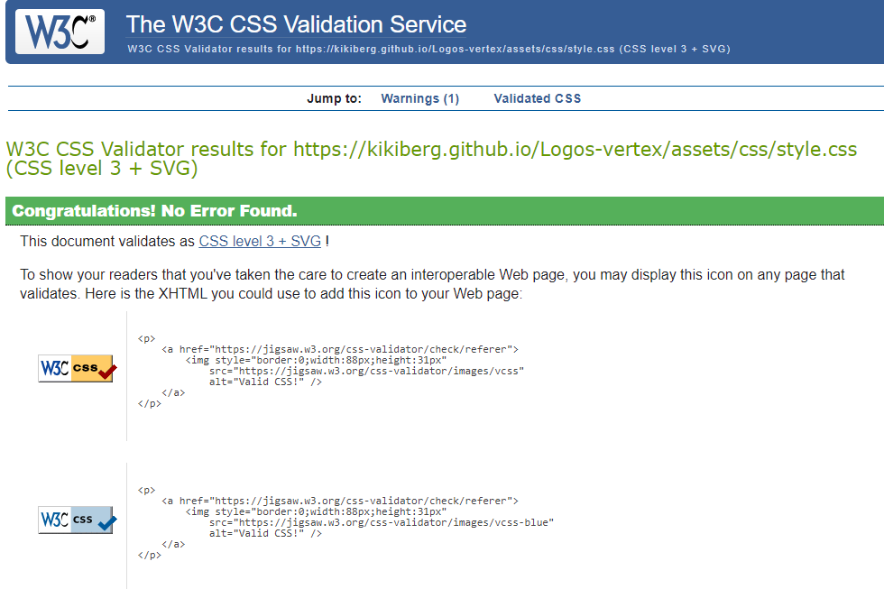

# The Logos vertex! -  Testing

Visit the deployed site: [The Logos vertex](https://kikiberg.github.io/Logos-vertex/)

Return back to the [README.md](README.md) file.

- - -

## CONTENTS

* [AUTOMATED TESTING](#automated-testing)
  * [W3C & JSHint Validators](#validators)
  * [Lighthouse](#lighthouse)
  * [Responsiveness](#responsiveness)
  * [Browser Compatibility](#browser-compatibility)

* [MANUAL TESTING](#manual-testing)
  * [Testing User Stories](#testing-user-stories)
  * [User Testing](#user-testing)
  * [Full Testing](#full-testing)

* [BUGS](#bugs)

Testing was ongoing throughout the entire process of building the project. I utilised Chrome developer tools whilst building to pinpoint and troubleshoot any issues as I went along.
I used Chrome dev tools also to make sure and check responsivity on a variety of different screen sizes and devices.

- - -

## AUTOMATED TESTING

### W3C & JSHint Validators

[W3C](https://validator.w3.org/) was used to validate the HTML and CSS.
[JSHint](https://jshint.com/) was used to validate the Javascript.

#### W3C HTML Validator

Page | W3C URL | Screenshot | Notes |
| --- | --- | --- | --- |
| Main page | [W3C](https://validator.w3.org/nu/?doc=https%3A%2F%2Fkikiberg.github.io%2FLogos-vertex%2F) |  | Passed. No warnings or errors |

#### W3C CSS Validator

File | Screenshot | Notes |
| --- | --- | --- |
| style.css |   | 1 warning on line 193 which I ignored. |

#### JSHint Javascript Validator

File | Screenshot | Notes |
| --- | --- | --- |
| style.css |  | Warnings about: 'const', 'let in ES6', 'arrow function syntax', 'template literal syntax in ES6'. I ignored these warnings. |

- - -

### Lighthouse

I used Lighthouse within the Chrome Developer Tools to test the performance, accessibility, best practices and SEO of the website.

#### Desktop and Mobile Results

| Page | Mobile | Desktop | Notes |
| --- | --- | --- | --- |
| Main page |  |  | Some minor warnings |

- - -

### Responsiveness

I have tested my deployed project on multiple devices to check for responsiveness issues. No issues were found.
Apart from the Chrome Devtools, I've used [this site](http://www.responsinator.com/) to quickly check responsiveness on different devices and get screenshots for the testing.md file. The screenshots for desktop are from devtools.

`Main Page`

| Mobile | Mobile landscape | Tablet | Desktop | Pass/Fail |
| --- | --- | --- | --- | --- | 
| |  |  |  | Pass. Works as expected |

- - -

### Browser Compatibility

I have tested my deployed project on two different browsers to check for compatibility issues. I could not find any issues.

| Browser | Main page |
| --- | --- |
| Chrome |  | 
| Edge |  | 

- - -

## MANUAL TESTING

### Testing User Stories

`First Time Visitors`

| Goals | How are they achieved? |
| :--- | :--- |
| I want to make it interesting enough for possible future employers to see. | There is a "say hi on Linkedin" link on the Home page leading to my profile on Linkedin. |
| I want the site to be responsive for different device sizes. | I have developed the site with responsiveness in mind. |
| I want the site to be easy to navigate. | Clean buttons are used throughout the site for navigation, much like a mobile app. The navbar is collapsing when being used on mobile. |

`Returning and Frequent Visitors`

|  Goals | How are they achieved? |
| :--- | :--- |
| I want to be able to see updates (news page) about Kiki's fulfillments. | Users will be able to follow my engagement and achievements as a fullstack software developer. |

- - -

### User Testing

A friend tested it on her iPhone 13 and provided screenshots.
Additional testing was taken by other friends and family on a variety of devices and screen sizes. They reported no issues when using the website.

`Main Page`

Screenshot | Pass/Fail |
| --- | --- |
|  | Pass. Works as expected |

`Pop-up windows`

| Screenshot | Pass/Fail |
| --- | --- |
|  | Pass. Works as expected |
|  | Pass. Works as expected |

- - -

### Full Testing

Full testing was performed on the following devices:

* DESKTOP-24171KO
* Display: Apple 27" LED Cinema

`Main Page`

| Feature | Expected Outcome | Testing Performed | Result | Pass/Fail | Screenshot |
| --- | --- | --- | --- | --- | --- |
| Alphabet button | Color should change to lighter | Hover | Color changes to lighter | Pass |  |
| Disable an already chosen letter from being chosen again  | Color should change to lighter and letter should be locked | Choose letter | Color gets lighter and letter button is being locked | Pass |  |
| Refresh button | Color should change to green | Hover | Color changes to green | Pass |  |
| Chances numbers | Chances should count upon choosing a letter  | Click | Chances start counting upon choosing a letter | Pass |  |
| Line under letter | It should disappear when choosing the right letter | Click | It disappears | Pass |  |
| Modal when failing| A window with a brown cat should pop up  | Click | A window with a brown cat pops up | Pass |  |
| Modal when winning| A window with a cat giving hi5 should pop up  | Click | A window with a cat giving hi5 pops up  | Pass |  |
| Try again button | Color should change to lighter | Hover | Color changes to lighter | Pass |  |

- - -

## BUGS

The thankyou page appears correctly upon submitting the contact form.
When validating my thankyou page, I got this bug: .
The answer I got from Tutor support is that I could not get any help, as it is not a language that it is not taught on the course.

